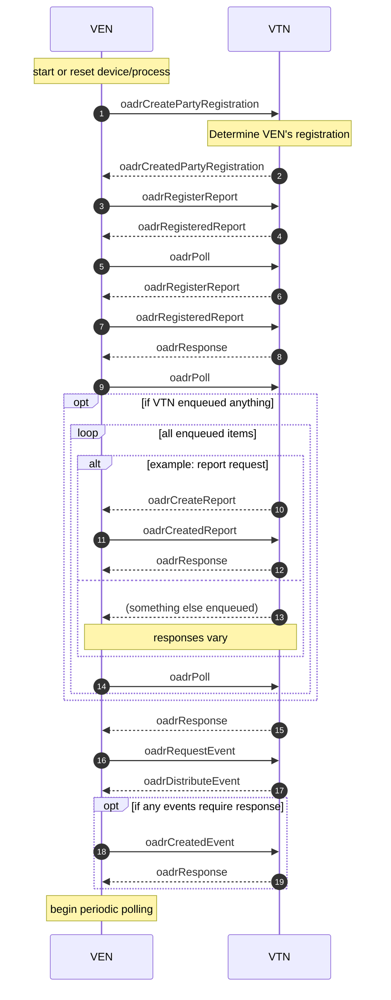

# Background
An API, or Application Programming Interface, is like a bridge that allows different software applications to talk to each other. It defines a set of rules and protocols for communication, enabling systems to exchange data and work together.

# Feature Request
Customer API access is a highly requested feature.  We are in the design phase of this feature.  We have set a soft launch date to make this feature available by the end of 2023.
While I wish I could offer this feature right now, there are advantages to being involved in the design phase.  There is still plenty of time for technical discussions so that when it launches we can make sure we cover your use case.

# What Can You Tell Me Now?
First, thanks for being interested.  Our API will provide access to the two most important elements of battery systems: telemetry data and controls.  
Telemetry data is timeseries data that is gathered remotely.  Voltage, current, cell temperature, and state of charge are all examples of telemetry data.
A lot of time and development goes into our control algorithms.  In general it is not recommended that customers control their own batteries.  If this is a requirement for particular use cases, we will provide the ability to control their devices remotely.  Control here means charge and discharge on a schedule.  Take note that using this feature will override our EMS’s ability to control the battery intelligently.  Only customers who are very confident in their software and controls should use this feature.  
Our API will be built around a standard called OpenADR.  We believe in open data and open standards.  OpenADR has a thriving community and is actively being supported.

# Can I have more technical details?
OpenADR defines two different roles:
-	a “top node” or VTN, which acts as a server.  
-	An “end node” or VEN, which acts as the client.
The API will work cloud-to-cloud.  Fortress will make your devices available as a VEN.  The VEN will send telemetry data as OpenADR “Reports” and controls as OpenADR “Events”.  It will be up to the VTN to read these reports and schedule these events. 

If you'd like to consume our API, you can create an OpenADR2.0b compliant VTN.  

# Why did you create this sandbox?
It's often helpful to have a piece of working code to develop against.  Please note that everything in this sandbox that isn't specified in the OpenADR spec is subject to change.  This can include the names of the data points.  The best use of this sandbox is as a way to make sure that your VTN can connect and receive data, and not to depend on the specifities of that data.

This sandbox is meant as a tool for software developers.  The real API will not be distributed as a set of docker containers.  It will be hosted online.  

# How can I start to implement a VTN?

If you're new to OpenADR, I recommend becoming familiar with [the specification](https://openadr.memberclicks.net/index.php?option=com_mcform&view=ngforms&id=24296#!/).  A discussion of how OpenADR works and all the configurable parameters is outside the scope of this document.  Instead we will go through a quick workflow.  

Overall, the steps are:



> In the examples that follow, anywhere you see a reference to a requestID such as `<ns3:requestID>1890A6BF01</ns3:requestID>` you will need to read the requestID sent by the VEN and return the same string in the response.

At a minimum, a VTN will implment these steps. 

- Respond to the VEN's oadrCreatePartyRegistration with 
[createdPartyRegistration](example_payloads/createdPartyRegistration.xml)
- The VEN will inform the VTN about which reports (i.e. telemetry data) are available.  This is called "registering" a report.  The VTN responds with [oadrRegisteredReport](example_payloads/createdPartyRegistration.xml)
- Respond to a VEN's polling requests.  The VTN can send a trivial [oadrResponse](example_payloads/oadrResponse.xml).
- If you would like the VEN to send its telemetry data, the VTN must respond to a poll request with a command to the VEN to [oadrCreateReport](example_payloads/oadrCreateReport.xml).  The VEN will respond with the report.  The VTN must then send the [oadrResponse](example_payloads/oadrResponse.xml).


# I'd like more help implementing a VTN

We use a product called Canvas from [GridFabric.io](https://www.gridfabric.io/).  Full disclosure that GridFabric is wholly owned by Fortress Power.  Canvas abstracts away much of the complexity of OpenADR.  You would then implement a Canvas plug-in to your own business logic, rather than a whole OpenADR implementation from scratch.  This sandbox was tested against Canvas.

# Tutorial

To run this demo sandbox you will need docker and docker-compose.  First, copy the environment file and rename it.
```bash
cp example_environment_file.env .env
```

Then edit it to change the `VTN_URL` to the actual URL that you are hosting your VTN at.

Next docker login to the container repository.
```bash
docker login -u $FORTRESS_API_USERNAME -p $FORTRESS_API_PASSWORD fpedgeplatformsflab.azurecr.io
```
You will need to get your `$FORTRESS_API_USERNAME` and `$FORTRESS_API_PASSWORD` from your sales representative. 


Next, `docker-compose up`.  The log messages from the containers will display to your screen.  Two docker containers will be created
```bash
$ docker ps
CONTAINER ID   IMAGE                                                   COMMAND                  CREATED          STATUS         PORTS                                      NAMES
d1f6ca72e595   fpedgeplatformsflab.azurecr.io/api-sandbox/ven:latest   "./plaidven schema.j…"   14 minutes ago   Up 1 second    0.0.0.0:8000->8000/tcp                     api-sandbox-ven-1
1c07f3c1e3f2   fpedgeplatformsflab.azurecr.io/api-sandbox/fortress_ven_middleware:0.0.1                           "python middleware.py"   14 minutes ago   Up 2 seconds   8081/tcp                                   api-sandbox-middleware-1
```

The VEN is running in the container `api-sandbox-ven-1`.  It will attempt to connect to the VTN at the URL you gave in the `.env` file.  The VEN will follow the logic from the diagram above.  You can use this to test your VTN implementation.  

# Version Notes

## V0.0.1 Initial release

A very basic VEN is included in the middleware.  It sends only a few data points in a report.  It gives a trivial response to events, but does not change its charge or discharge behavior. 